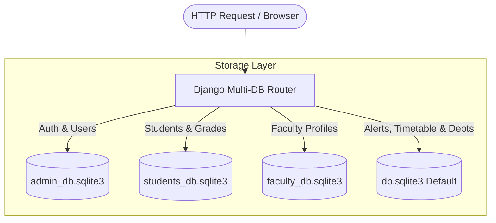

# ⚡ Smart College ERP Management System

<p align="center">
  
  
  
  
  
</p>

---

## 📌 Executive Overview

**Smart College ERP** is a modern Enterprise Resource Planning suite designed for academic institutions. It provides real-time operations management across **Administration**, **Faculty**, and **Students**. Featuring multi-database routing, live room notices, interactive timetable grids, roll-number based attendance, coursework management, and 2-sided digital printable ID cards.

---

## 🏗️ System Architecture & Multi-Database Topology

The application enforces strict data isolation and security by implementing a **Custom Django Database Router** distributing data across 4 dedicated SQLite engines:



### Database Map
| Database File | Django App | Handled Models / Domain |
| :--- | :--- | :--- |
| 🛡️ `admin_db.sqlite3` | `accounts` | Custom User authentication, User Roles (`Admin`, `Faculty`, `Student`) |
| 🎓 `students_db.sqlite3` | `students` | Student Profiles, Assignments, Submissions, GPA Results, Exam Eligibility |
| 👨‍🏫 `faculty_db.sqlite3` | `faculty` | Faculty Profiles, Designations, Qualifications, Office Locations |
| 🏛️ `db.sqlite3` | `departments` / Core | Departments, `ClassroomAlert`, `TimetableSlot`, Sessions, Django System Tables |

---

## ⚡ Core Feature Modules

### 📢 1. Live Classroom Alerts & Notices
* **Real-time Broadcasts**: Instant notices for room changes, emergency cancellations, or schedule adjustments.
* **Priority Badging**: `URGENT`, `HIGH`, `MEDIUM`, `LOW` tags with clear color coding.
* **Search & Filter**: Live client-side filtering by notice category, department, or keyword search.

### 🗓️ 2. Visual Weekly Timetable Grid
* **Weekly Schedule**: Interactive Monday-Saturday grid mapping hours to subjects, faculty, and room numbers.
* **Dashboard Widgets**: Dynamic **Today's Class Schedule** timeline card for quick access.

### 📋 3. Attendance by Roll Number
* **Sequential Roll Sort**: Cohorts sorted strictly by alphanumeric Roll Number (e.g. `CS-2026-101`).
* **Instant Roll Search**: Auto-complete search bar to quickly mark attendance (+1 Present / Absent).
* **Batch Controls**: One-click **Mark All Present** and **Mark All Absent** options.

### 🎴 4. Two-Sided Digital Printable ID Cards
* **Role-Specific Cards**: Customized layouts for **Students**, **Faculty**, and **Admins**.
* **Front Side**: Profile picture, Full Name, ID/Roll Number, Department, and Validity period.
* **Back Side**: Live **JsBarcode** SVG generation, contact info, address, and official digital seal.

---

## 🚀 Quick Setup & Installation

### Prerequisites
* **Python 3.10+**
* **pip** & **virtualenv**

### Installation Steps

1. **Clone or Navigate to the Workspace**
   ```bash
   cd erpsystem
   ```

2. **Set Up Virtual Environment**
   ```bash
   # On Windows PowerShell
   python -m venv venv
   .\venv\Scripts\Activate.ps1

   # On macOS / Linux
   python3 -m venv venv
   source venv/bin/activate
   ```

3. **Install Dependencies**
   ```bash
   pip install -r requirements.txt
   ```

4. **Environment Configuration (`.env`)**
   Create a `.env` file in the project root:
   ```env
   DEBUG=True
   SECRET_KEY=django-insecure-smart-college-erp-dev-key
   DATABASE_URL=sqlite:///db.sqlite3
   STUDENTS_DATABASE_URL=sqlite:///students_db.sqlite3
   FACULTY_DATABASE_URL=sqlite:///faculty_db.sqlite3
   ADMIN_DATABASE_URL=sqlite:///admin_db.sqlite3
   ALLOWED_HOSTS=localhost,127.0.0.1
   ```

5. **Apply Multi-Database Migrations**
   ```bash
   python manage.py makemigrations
   python manage.py migrate --database=default
   python manage.py migrate --database=admin
   python manage.py migrate --database=students
   python manage.py migrate --database=faculty
   ```

6. **Seed Demo Data**
   ```bash
   python seed_db.py
   ```

7. **Launch Development Server**
   ```bash
   python manage.py runserver 0.0.0.0:8000
   ```
   Access the dashboard at `http://127.0.0.1:8000/`.

---

## 🔑 Pre-Configured Test Accounts

| Role | Username | Password | Key Functionalities |
| :--- | :--- | :--- | :--- |
| **👑 Admin** | `admin` | `admin123` | Department Control, Analytics, User Creation, Admin ID Card |
| **👨‍🏫 Faculty (CSE)** | `prof_sharma` | `password123` | Roll Attendance, Notices, Timetable, Grading |
| **👨‍🏫 Faculty (EE)** | `prof_patel` | `password123` | Roll Attendance, Notices, Timetable, Grading |
| **🎓 Student (CSE)** | `student_amit` | `password123` | My Assignments, Timetable, Alerts, Student ID Card |
| **🎓 Student (EE)** | `student_sneha` | `password123` | My Assignments, Timetable, Alerts, Student ID Card |
| **🎓 Student (ME)** | `student_kabir` | `password123` | My Assignments, Timetable, Alerts, Student ID Card |

---

## 🎨 Tech Stack Summary

* **Backend**: Django 5.x, Python
* **Frontend**: HTML5, Vanilla CSS (Glassmorphic Theme System), Bootstrap 5.3, FontAwesome 6
* **Data Visualization & Media**: Chart.js, JsBarcode, Django Media Storage
* **Database**: Multi-instance SQLite3 Architecture

---

## 📄 License & Attribution
Designed & developed for Smart College ERP Management. All rights reserved.
